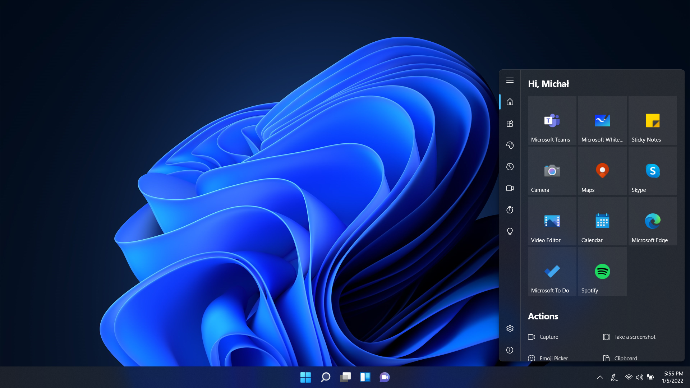

# Desktop Toolkit

Welcome to the official issue-only repo for Desktop Toolkit. This is a desktop app that replaces built-in Windows Ink Workspace in Windows 10 and delivers more usefull tools. App primarily uses WPF and UWP (as XAML Islands).

  

  

Feel free to share ideas about new features or report bugs.

## Translations
German: [@lorisobidesign](https://twitter.com/lorisobidesign)  
Italian: [@Simizfo](https://twitter.com/Simizfo)  
Portuguese (Portugal): [@esibruti](https://twitter.com/esibruti)  
Spanish (Spain): [@qrbt_ok](https://twitter.com/qrbt_ok)
